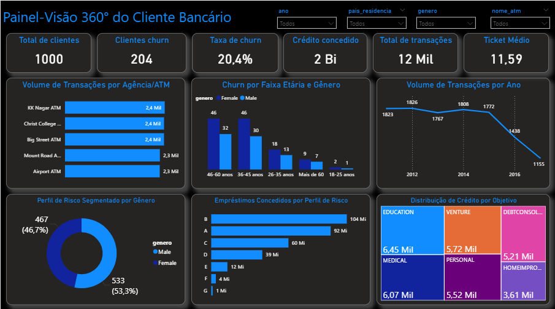

Projeto – Visão 360° do Cliente Bancário

📌 Descrição

Este projeto consiste na construção de uma solução analítica completa para análise de clientes bancários, risco de crédito e churn.

A arquitetura segue boas práticas de modelagem dimensional (Star Schema) e construção de KPIs estratégicos em Power BI.

🎯 Objetivos

Monitorar churn de clientes

Analisar perfil de risco

Avaliar comportamento transacional

Analisar concessão de crédito

Criar visão executiva consolidada

## 🐍 Etapa Python (Pandas)
Na pasta `/jupyter_ipynb`, encontras o processo de:
- Limpeza de dados corrompidos.
- Engenharia de Atributos (Feature Engineering) para calcular o risco inicial.
- Exportação dos dados limpos para consumo em SQL/Power BI.

  ## 🚀 Tecnologias Utilizadas
- **Python (Pandas)**: Manipulação e limpeza.
- **Power BI**: Visualização e DAX.
- **SQL**: Criação de tabelas e views de negócio.

🏗 Arquitetura
🔄 Pipeline de Dados

Python (Pandas) → SQL (Modelagem Dimensional) → Power BI (Dashboard + DAX)

📊 Modelo de Dados

Dimensões:

d_clientes_churn

d_calendario

d_agencias_atm

Fatos:

f_transacoes

f_credito_risco

Modelo estrela implementado na camada de banco de dados.

📈 KPIs Desenvolvidos

Total de Clientes

Clientes Churn

Taxa de Churn (%)

Crédito Concedido

Total de Transações

Ticket Médio

🛠 Tecnologias Utilizadas

Python (Pandas)

SQL

Power BI

DAX

📊 Principais Insights

Identificação de segmentos com maior churn

Relação entre risco e concessão de crédito

Análise temporal de transações

Distribuição de crédito por objetivo

## 🕵️ Insights de Auditoria (Pensamento Analítico)
Após analisar os dados, identifiquei três pontos críticos que exigem atenção imediata:

1. **Risco de Evasão (Churn):** A taxa de perda de clientes está em **20%**. Isto significa que 1 em cada 5 clientes abandonou o banco, sinalizando uma crise de retenção.
2. **Queda no Volume Transacional:** Entre 2015 e 2016, houve uma redução drástica na atividade dos clientes. O banco está a tornar-se menos relevante no dia a dia dos utilizadores.
3. **Concentração de Crédito:** Grande parte do capital está alocada em créditos de categoria A e B. Sem clientes ativos para sustentar o fluxo, o risco de incumprimento aumenta.

## 🚀 Próximos Passos (Roadmap de Evolução)
Para elevar a maturidade desta análise, planeio implementar:
* **Modelagem Preditiva de Churn:** Criar um modelo para prever quais clientes têm maior probabilidade de sair antes que o façam.
* **Segmentação por Machine Learning:** Agrupar clientes por comportamento de gasto e risco.
* **Automatização de Pipeline:** Integrar os dados para que o dashboard se atualize automaticamente.

  ## 🎯 Conclusão
Este projeto demonstra a importância de olhar além dos gráficos. A análise sugere que a
instituição precisa de um plano de retenção urgente para evitar a falência a longo prazo.

